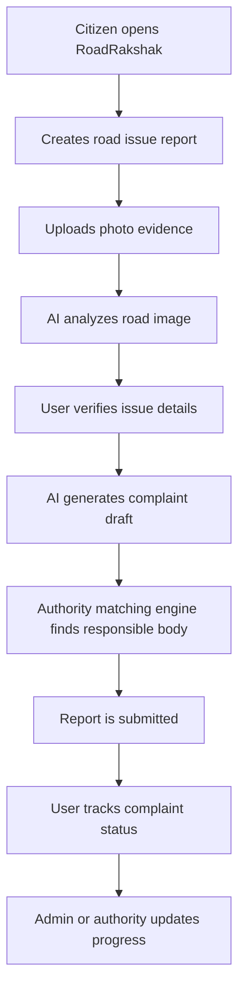
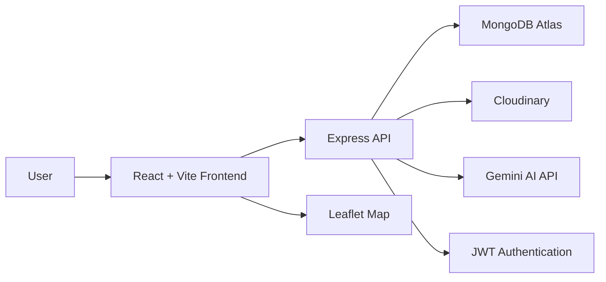

# RoadRakshak

<p align="center">
  <strong>AI-powered road issue reporting and civic complaint routing platform for India</strong>
</p>

<p align="center">
  Report road damage. Detect issues with AI. Find the right authority. Generate better complaints. Track action.
</p>

<p align="center">
  <a href="https://road-rakshak-one.vercel.app">Live Website</a>
  |
  <a href="https://roadrakshak.onrender.com">Backend API</a>
  |
  <a href="https://github.com/aryathakurds/RoadRakshak">GitHub Repository</a>
</p>

<p align="center">
  
  
  
  
  
</p>

---

## Overview

RoadRakshak is a full-stack civic-tech platform built to make road issue reporting easier, smarter, and more action-oriented.

Instead of only letting users complain about bad roads, RoadRakshak helps users create structured road reports with photo evidence, location, AI-generated complaint text, severity analysis, and responsible authority matching.

The long-term vision is to build an India-wide intelligent road safety reporting network where citizens can report road issues and authorities can respond with accountability.

> Every road issue reported is one step toward a safer India.

---

## Live Deployment

| Service | Link |
|---|---|
| Frontend | https://road-rakshak-one.vercel.app |
| Backend API | https://roadrakshak.onrender.com |
| GitHub | https://github.com/aryathakurds/RoadRakshak |

---

## The Problem

Road problems such as potholes, cracks, broken surfaces, waterlogging, open manholes, and damaged dividers are common in many Indian cities.

But reporting them is difficult because:

- Citizens often do not know which authority is responsible.
- Complaint portals are scattered across cities and departments.
- Reports usually lack structured evidence.
- Users may not know how to write a proper complaint.
- There is no simple way to track whether action was taken.
- Social media posts may get attention but are not structured civic records.

---

## The Solution

RoadRakshak brings the complete road reporting process into one platform.

A user can:

1. Upload a road issue photo.
2. Add location and issue details.
3. Use AI to analyze the road issue.
4. Generate a formal complaint automatically.
5. Match the issue with the responsible authority.
6. Submit and track the report.
7. View reports on a dashboard and map.

---

## Core Features

### AI Road Issue Detection

RoadRakshak can analyze uploaded road images and identify possible road-related problems.

Supported issue categories include:

- Potholes
- Road cracks
- Broken road surface
- Waterlogging
- Open manholes
- Garbage or obstruction
- Damaged dividers
- Missing signs

The AI output helps users understand the issue before submitting the final report.

### AI Complaint Generator

RoadRakshak generates a formal complaint from user inputs.

The generated complaint can include:

- Complaint title
- Clear issue description
- Risk summary
- Suggested action
- Recommended severity
- Responsible department context
- Citizen-ready complaint draft

This makes complaint filing easier for users who may not know how to write an official complaint.

### Smart Authority Matching

RoadRakshak includes an authority matching system that connects reports with the likely responsible body.

Examples:

- Municipal corporation
- Ward office
- Road maintenance department
- Public Works Department
- National highway authority
- Local civic complaint portal

This feature makes RoadRakshak more useful than a normal posting platform because every report is connected to possible action.

### Report Tracking

Users can track reports through statuses such as:

- Submitted
- Complaint ready
- Under review
- In progress
- Resolved

This gives users a clearer view of what is happening after a report is created.

### Admin and Authority Dashboard

RoadRakshak supports role-based access.

User roles include:

- Citizen
- Moderator
- Authority
- Admin

Admins can manage reports, authorities, and report status from dedicated dashboard pages.

### Interactive Map

RoadRakshak includes a map view to show road issues based on location.

This helps identify:

- Issue-heavy zones
- Repeated complaint areas
- City-level road problem patterns
- High-risk locations

### Authentication

The platform includes secure user authentication using JWT.

Supported authentication features:

- Register account
- Login
- Protected user reports
- Role-based access
- Admin-only pages

### Cloud Image Upload

Road issue photos are uploaded through Cloudinary.

This keeps the database lightweight while still storing real photographic evidence for every report.

---

## Product Workflow



---

## System Architecture



---

## Tech Stack

### Frontend

- React
- Vite
- JavaScript
- CSS
- Lucide React Icons
- React Leaflet
- Leaflet Maps

### Backend

- Node.js
- Express.js
- MongoDB Atlas
- Mongoose
- JWT
- bcryptjs
- Multer
- Cloudinary
- Express Rate Limit

### AI

- Gemini API
- AI complaint generation
- AI road image analysis

### Deployment

- Vercel for frontend
- Render for backend
- MongoDB Atlas for database
- Cloudinary for image storage

---

## Pages Included

| Page | Purpose |
|---|---|
| Dashboard | Main product homepage and report overview |
| New Report | Create a new road issue report |
| My Reports | View reports created by the user |
| AI Detection | AI-based road issue detection section |
| Issue Map | Map-based report visualization |
| Complaints | Complaint-ready report view |
| Authorities | Authority directory |
| Report Status | Track report progress |
| Profile | User profile and account details |
| Report Admin | Admin report management |
| Authority Admin | Admin authority management |

---

## API Routes

### Authentication

```txt
POST /api/auth/register
POST /api/auth/login
GET  /api/auth/me
```

### Reports

```txt
GET    /api/reports
POST   /api/reports
PUT    /api/reports/:id
DELETE /api/reports/:id
```

### AI

```txt
POST /api/ai/generate-report
POST /api/ai/analyze-road-photo
```

### Authorities

```txt
GET    /api/authorities
POST   /api/authorities
PUT    /api/authorities/:id
DELETE /api/authorities/:id
POST   /api/authorities/match
```

### Locations

```txt
GET /api/locations
```

---

## Folder Structure

```txt
RoadRakshak
|
|-- client
|   |-- public
|   `-- src
|       |-- components
|       |-- hooks
|       |-- pages
|       |-- services
|       |-- utils
|       |-- App.jsx
|       `-- main.jsx
|
|-- server
|   |-- src
|   |   |-- config
|   |   |-- controllers
|   |   |-- middleware
|   |   |-- models
|   |   |-- routes
|   |   `-- scripts
|   `-- server.js
|
`-- README.md
```

---

## Local Setup

### 1. Clone the Repository

```bash
git clone https://github.com/aryathakurds/RoadRakshak.git
cd RoadRakshak
```

### 2. Backend Setup

```bash
cd server
npm install
```

Create a `.env` file inside the `server` folder.

```env
PORT=5000
MONGO_URI=your_mongodb_atlas_connection_string
JWT_SECRET=your_jwt_secret

CLIENT_URL=http://localhost:5173

CLOUDINARY_CLOUD_NAME=your_cloudinary_cloud_name
CLOUDINARY_API_KEY=your_cloudinary_api_key
CLOUDINARY_API_SECRET=your_cloudinary_api_secret

GEMINI_API_KEY=your_gemini_api_key
GEMINI_MODEL=gemini-3.5-flash
```

Run the backend:

```bash
npm run dev
```

Backend will run on:

```txt
http://localhost:5000
```

### 3. Frontend Setup

Open a new terminal.

```bash
cd client
npm install
```

Create a `.env` file inside the `client` folder.

```env
VITE_API_URL=http://localhost:5000/api
```

Run the frontend:

```bash
npm run dev
```

Frontend will run on:

```txt
http://localhost:5173
```

---

## Deployment Setup

### Render Backend Environment Variables

```env
PORT=5000
MONGO_URI=your_mongodb_atlas_connection_string
JWT_SECRET=your_jwt_secret

CLIENT_URL=https://road-rakshak-one.vercel.app

CLOUDINARY_CLOUD_NAME=your_cloudinary_cloud_name
CLOUDINARY_API_KEY=your_cloudinary_api_key
CLOUDINARY_API_SECRET=your_cloudinary_api_secret

GEMINI_API_KEY=your_gemini_api_key
GEMINI_MODEL=gemini-3.5-flash
```

### Vercel Frontend Environment Variable

```env
VITE_API_URL=https://roadrakshak.onrender.com/api
```

---

## What Makes RoadRakshak Unique?

RoadRakshak is not just a complaint form.

It combines:

- AI image understanding
- AI complaint writing
- Civic authority routing
- Location-based reporting
- Admin review workflow
- Public issue tracking
- India-wide expansion vision

The unique part is the combination of citizen evidence, AI-generated civic complaint, and responsible authority matching in one platform.

---

## Resume Value

RoadRakshak is resume-worthy because it demonstrates:

- Full-stack application development
- Real-world problem solving
- REST API design
- Authentication and authorization
- MongoDB schema design
- Cloud image upload
- AI API integration
- Role-based dashboards
- Deployment experience
- Product thinking
- Civic-tech innovation

A strong resume line could be:

```txt
Built RoadRakshak, an AI-powered civic-tech platform for reporting road issues, generating structured complaints, matching responsible authorities, and tracking report status using React, Node.js, Express, MongoDB Atlas, Cloudinary, and Gemini AI.
```

---

## Current Project Status

RoadRakshak currently includes:

- Deployed frontend
- Deployed backend
- User authentication
- Road issue reporting
- Image upload
- AI report generation
- AI road photo analysis
- Authority matching
- Admin report management
- Authority management
- Report tracking
- Map visualization
- MongoDB Atlas database integration

---

## Future Roadmap

### 1. Official India-Wide Authority Database

Add verified official authority data for:

- States
- Districts
- Cities
- Wards
- Municipal corporations
- PWD offices
- Highway authorities

This will make the authority matching system more accurate.

### 2. Real Government Portal Integration

Future versions can connect reports with official complaint portals.

Planned options:

- Redirect to correct portal
- Auto-fill complaint fields
- Generate complaint PDF
- Store complaint reference number
- Track complaint progress

### 3. Custom ML Road Damage Model

Train a dedicated road damage detection model for Indian road conditions.

Possible model classes:

- Pothole
- Crack
- Broken surface
- Waterlogging
- Open manhole
- Garbage obstruction
- Damaged divider
- Missing sign

### 4. Duplicate Report Detection

Detect when multiple citizens report the same issue from the same location.

This can help identify serious issues and reduce duplicate complaints.

### 5. Authority Login Portal

Create a dedicated portal where authorities can:

- View assigned reports
- Update report status
- Add repair notes
- Upload repair proof
- Mark issue as resolved

### 6. Public Civic Analytics Dashboard

Add analytics such as:

- Most reported cities
- Most reported road issue types
- Pending complaints
- Resolved complaints
- Authority response rate
- High-risk zones

### 7. Mobile App

Build an Android and iOS version for faster on-road reporting.

Future mobile features:

- Camera-first reporting
- Auto GPS capture
- Push notifications
- Offline draft reports

### 8. Community Verification

Allow nearby users to verify whether a reported issue still exists.

This can improve trust and report accuracy.

### 9. Automated Priority Scoring

Use AI and report data to assign priority scores based on:

- Severity
- Road type
- Location
- Public risk
- Number of duplicate reports
- Time pending

### 10. Startup-Level Expansion

For a production civic-tech startup version, RoadRakshak can move toward:

- Municipal partnerships
- Verified authority dashboards
- SaaS tools for civic bodies
- Public safety analytics
- Repair performance tracking
- City-level infrastructure intelligence

---

## Security Note

This project uses private credentials such as:

- MongoDB URI
- JWT secret
- Cloudinary API secret
- Gemini API key

Never commit real keys to GitHub.

Before making the project fully public or production-ready, rotate any keys that were accidentally shared or exposed.

---

## Author

**Arya Thakur**

GitHub: https://github.com/aryathakurds

---

## Vision

RoadRakshak aims to become an intelligent civic reporting layer for India, helping citizens report road issues clearly and helping authorities understand where action is needed.

The mission is to make road safety reporting faster, smarter, and more accountable.
